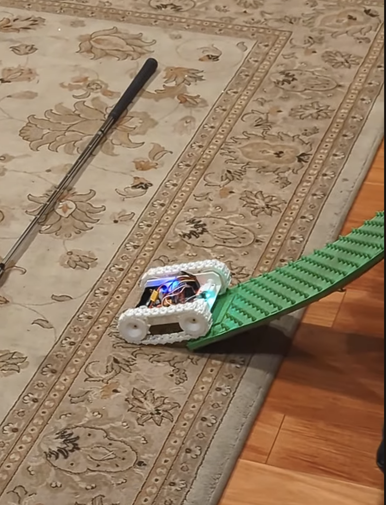

# White-Crash
This is for a 3d printed treaded rover robot built with low cost components. It targets low cost hardware, and all logic runs on a single Esp32-S2 mini.  This personal project isn't targed for others to use, but you're free to try.

[](https://youtube.com/shorts/mtOcJ6Oahmc)
*Click to watch demo video (YouTube Short)*

# Features
- RC via ELRS  with telemetry including GPS, battery, compass, and mode feedback. Works well with RadioMaster MT12.
- Micro Ros logging
- GPS Waypoint Following
- Calibrate compass from the remote control
- "Unstick" during auto mode detects stuck wheels and try to unstick them

# Hardware
- 3d printed components designed with OnShape, located [here]( https://cad.onshape.com/documents/dd970d9a6c26fa13387afec0/w/989678fcac76aa6658829e1f/e/ee8d8600e49e43744f819ec3?renderMode=0&uiState=67bcc1af65aeba45f00ff9b7) 

# Software

# Running

Launch micro-ros-agent (patched version - see [agent_crash_investigation.md](agent_crash_investigation.md)):

```bash
# From distrobox with ROS 2 Jazzy
distrobox enter jazzy
~/projects/Micro-XRCE-DDS-Agent/build/MicroXRCEAgent udp4 --port 8888 -v3
```

Or use Docker (unpatched - may crash on malformed packets):

```bash
docker run -it --rm -v /dev:/dev -v /dev/shm:/dev/shm --privileged --net=host microros/micro-ros-agent:jazzy udp4 --port 8888 -v3
```

## Building Patched Agent

```bash
cd ~/projects/Micro-XRCE-DDS-Agent
mkdir build && cd build
cmake ..
make -j$(nproc)
```

View log messages (note qos-depth):

```bash
ros2 topic echo /tank/log --qos-depth 50| grep -E --color=never -o "'.*\'"
```

Run Foxglove Bridge

```bash
cd
distrobox enter jazzy
~/projects/white-crash/ws
source install/setup.bash
#source /opt/ros/humble/setup.bash
ros2 run foxglove_bridge foxglove_bridge
```